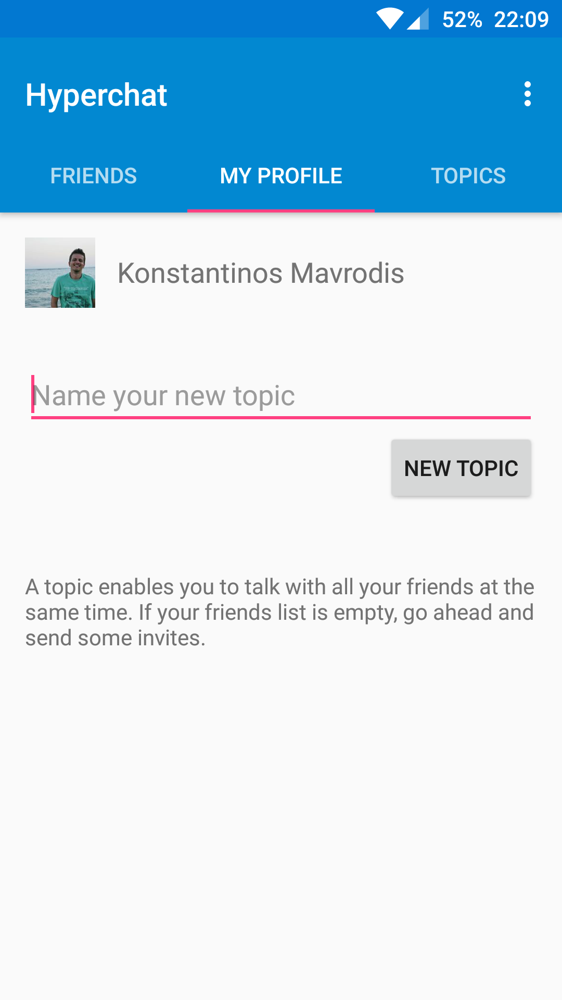
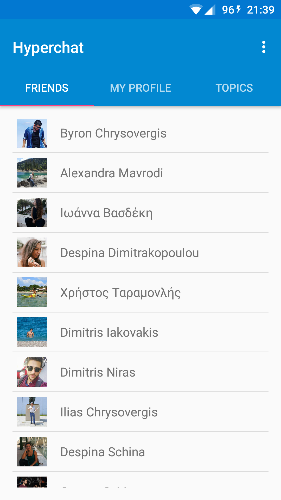
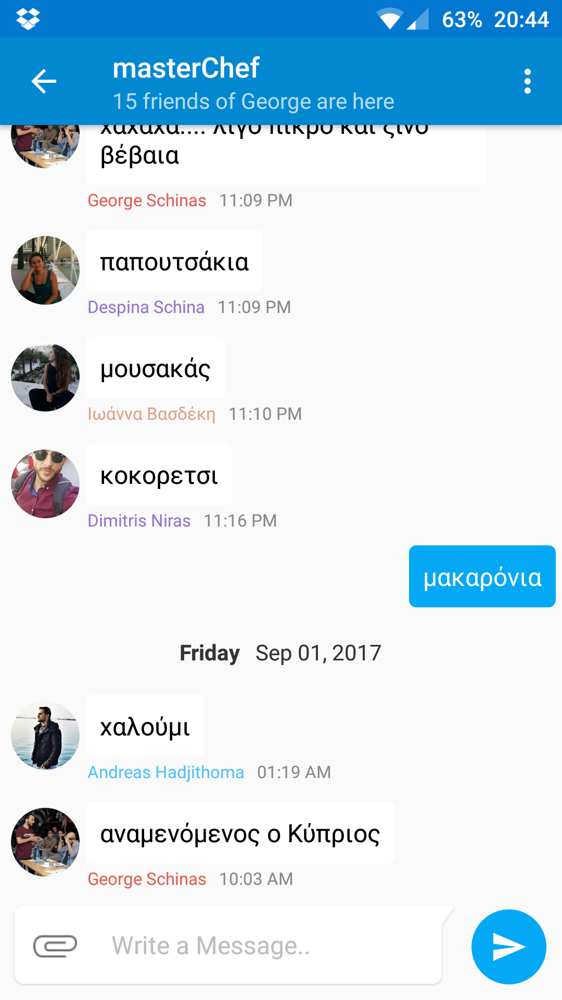

# Hyperchat

Use Hyperchat to chat with all your friends at the same time! 

You can create topics, which are chat rooms between you and all your contacts. Talk about anything, have fun and leave no-one behind! 
Create topics about sports, movies, science or anything really... Anyone interested can join the conversation!

A Beta version of Hyperchat is available on Google Play:

## Screenshots

